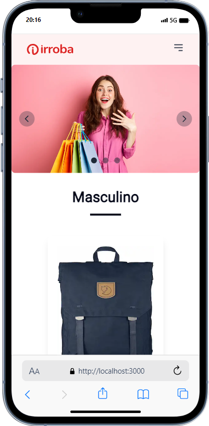
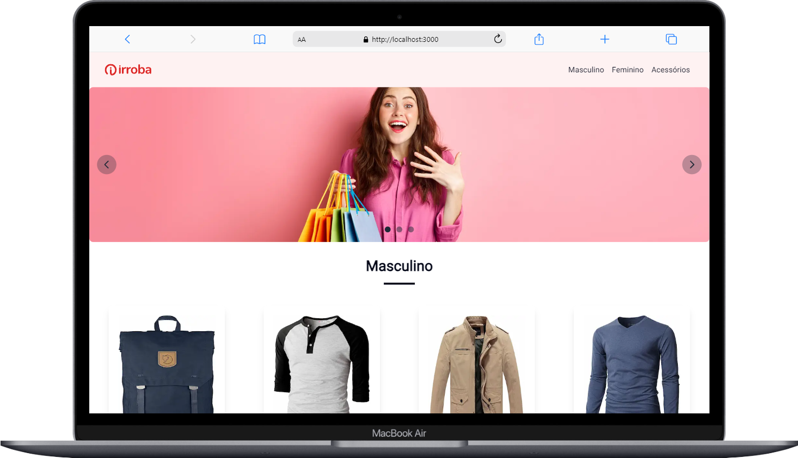

💻 Sobre o projeto

🔔 Projeto Loja Virtual

## Descrição

Página web que mostre produtos da fakestoreapi.

<br>
<hr>
<div align="center">
		
	
</div>
<hr>
<br>


### Ferramentas

- [NextJS](https://nextjs.org/)

- [TailwindCss](https://tailwindcss.com/docs/installation)

- [Git](https://git-scm.com/doc)

### Montagem do ambiente de desenvolvimento

O primeiro passo é clonar o projeto utilizando o método HTTPS ou SSH.

SSH

```sh
git clone git@github.com:eosantos/loja-virtual.git
```

HTTPS

```sh
git clone https://github.com/eosantos/loja-virtual.git
```

### Instalar dependências do projeto

Com o comando abaixo instalamos todos os pacotes definidos no package.json para configuração do servidor local:

```sh
npm i
```

### Acessando a aplicação

Para iniciar o projeto basta executar o comando abaixo:

```sh
npm run dev
```
Após a execução do comando acima basta abrir o link `http://localhost:3000`.
